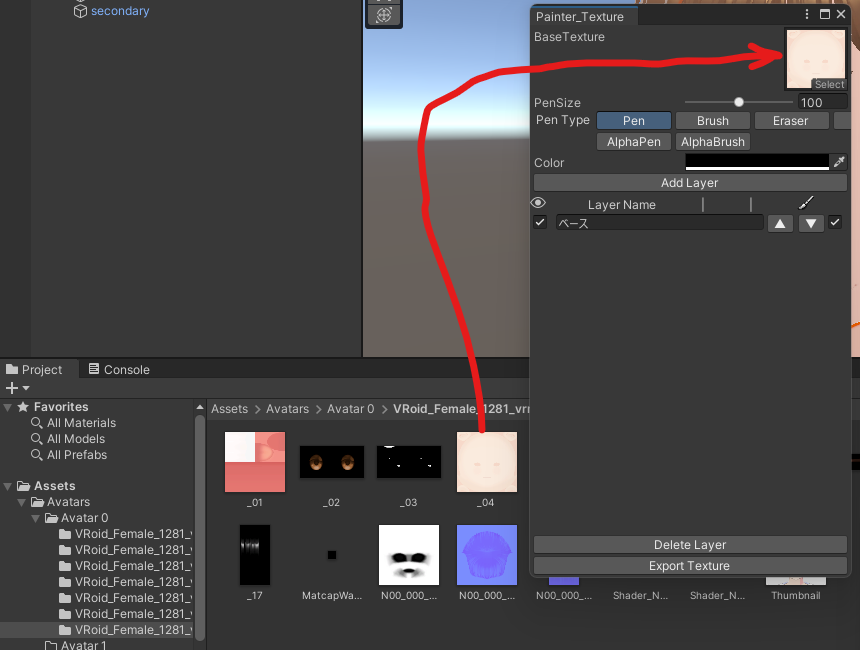

## ツールの導入

- unitypackage を Unity にドラッグ＆ドロップしてください。 
  (何も起こらない場合は Unity の Project ウィンドウの中の Assets フォルダを狙ってドラッグ＆ドロップすると良いです)

インポートする項目の確認画面が出てきますがそのまま import ボタンを押して良いです。

- ツールを起動するには Unity 上部の「Kuni_Tool」から使用したいツールを選択してください。

## テクスチャ単体編集系ツールの使用方法

- Project ウィンドウの中にある画像をツールにドラッグ＆ドロップしてください。

画像をセットした後はツール個別の使い方に従ってください。

## オブジェクト編集系ツールの使用方法

- Hierarchy ウィンドウの中にあるオブジェクトをツールにドラッグ＆ドロップしてください。 
  (例:SkinnedMeshRenderer が指定されているツールでは Face や Body 等をセットしてください)

オブジェクトをセットした後はツール個別の使い方に従ってください。
