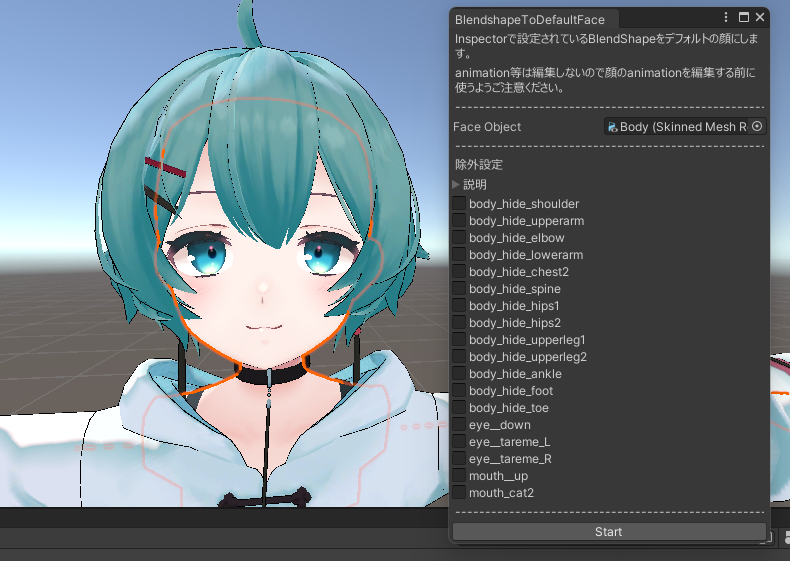
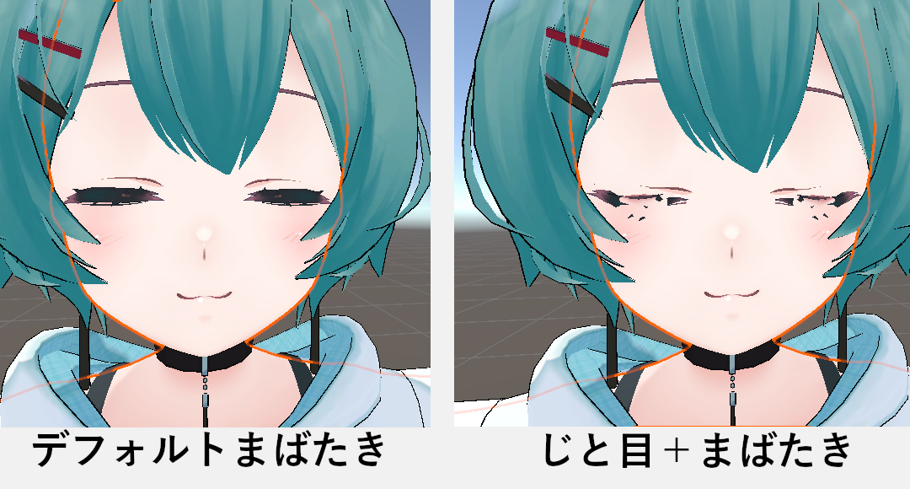

:::caution
このツールはご利用前に注意事項をよく読んでください。
:::

## 使い方

Hierarchy からデフォルトにしたい BlendShape があるオブジェクトをセットしてください。
Inspector 上での BlendShape の値をデフォルトにします。
Start ボタンを押すと処理が実行されます。

上画像の薄荷ちゃんアバターでのサンプルは[eye_down][eye_tareme_L,R][mouth_up][mouth_cat2]をデフォルトの顔にしようとしている図です。
(薄荷ちゃんアバターでは顔と身体のメッシュが同じなのでこのまま変換をすると身体の変更もデフォルトにしてしまいます。
この場合のデフォルト変換する時は身体の BlendShape は全て 0 にしておいた方が良いと思います。)

## 注意事項

このツールはセットされている BlendShape をデフォルトにすると共に、**全 BlendShape に差分を取ります**。

例えば「じと目」をデフォルトにした場合、元の「まばたき」をした時にメッシュが破綻してしまいます。

これを防ぐ為に「じと目」をデフォルトにした場合は「まばたき」の BlendShape を編集して「じと目」分をマイナスします。

'デフォルト顔　＋　まばたき　＝　正規まばたき
デフォルト顔　＋　じと目　＋　まばたき　＝　破綻まばたき
デフォルト顔（＋じと目）　＋　まばたき（ーじと目）　＝　正規まばたき'
