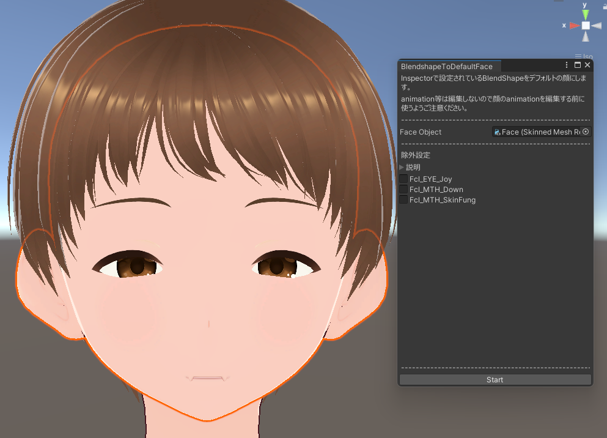
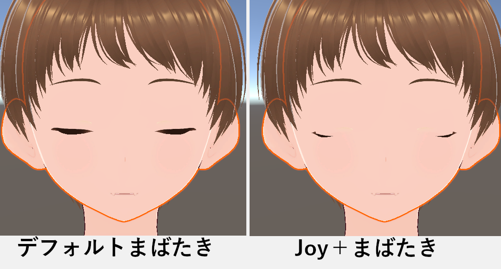
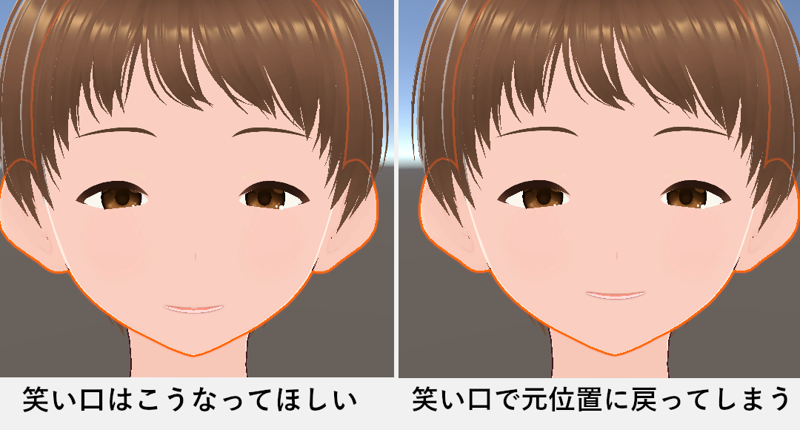
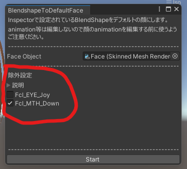

:::caution
このツールはご購入・ご利用前に注意事項をよく読んでください。
:::

## 使い方

Hierarchy からデフォルトにしたい BlendShape があるオブジェクトをセットしてください。<br>
Inspector 上での BlendShape の値をデフォルトにします。<br>
Start ボタンを押すと処理が実行されます。



上画像の VRoid アバターでのサンプルは[Fcl_EYE_Joy][Fcl_MTH_Down][Fcl_MTH_SkinFung]をデフォルトの顔にしようとしている図です。<br>
(一部のアバターでは顔と身体のメッシュが同じの場合があり、変換をすると身体の変更もデフォルトにしてしまいます。<br>
その場合のデフォルト変換する時は身体の BlendShape は全て 0 にしておいた方が良いと思います。)

## 注意事項

このツールはセットされている BlendShape をデフォルトにすると共に、**全 BlendShape に差分を取ります**。

例えば「Joy(楽しい目)」をデフォルトにした場合、元の「まばたき」をした時にメッシュが破綻してしまいます。



これを防ぐ為に「Joy」をデフォルトにした場合は「まばたき」の BlendShape を編集して「Joy」分をマイナスします。

```code枠
デフォルト顔　＋　まばたき　＝　正規まばたき
デフォルト顔　＋　 Joy 　＋　まばたき　＝　破綻まばたき
デフォルト顔（＋ Joy）　＋　まばたき（ー Joy）　＝　正規まばたき
```

ここで要注意なのが「正規まばたき」に矯正しているという点です。<br>
これはすなわち「**まばたきをした時に編集した顔から標準顔に戻る**」という事です。

例えば「MTH_Down(口下げ)」をデフォルトにした場合、笑い口にした時に口の位置が標準に戻ってしまいます。



これを防ぐ為に**除外設定**という機能を用意しました。



除外設定のチェックをオンにした場合、上記問題が起きないように BlendShape の差分計算から除外します。<br>
上画像のように「Fcl_MTH_Down」にチェックを入れていた場合、口の BlendShape を動かしても標準位置に戻らなくなります。

除外設定のコツとしては「変形するものは除外設定をオフ」 「位置調整系は除外設定をオン」にすると破綻しづらいと思います。<br>
また、変形が軽度でそのまま他の BlendShape を動かしても破綻しないものは除外設定をオンにしても良いかもしれません。

## 要注意

VRChat 等のアバターに使用した場合、animation により BlendShape が動かされます。<br>
想定外の場面で標準の顔に戻る可能性があるので animation 管理には十分ご注意ください。<br>
(友人とテストしていた際にマヌカちゃんアバターでジャンプをした時に目が元に戻る症状がありました)

- 小言<br>
  表情破綻についてなんとかしたかったのですが、新しい専用の Blendshape を生成するというのは足し算引き算では計算できず、AI の分野になりそうなので諦めました。<br>
  本ツールの仕様をご理解いただいた上でご利用頂けますと幸いです。
