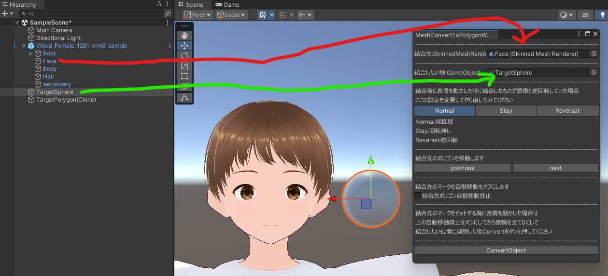

## 始めに

導入については[こちら](/Kuni_Tool/howto/install/)をご覧ください。

## 使い方

Hierarchy から結合先のオブジェクト(SkinnedMeshRenderer)をセットしてください。 
Hierarchy から結合したいオブジェクト(GameObject)をセットしてください。 

Scene 画面右上の Gizmos をオンにすると結合したいオブジェクトから結合先のポリゴンへ赤い線が繋がります。 

このツールは赤い線が繋がっているポリゴンの部分に結合を行います。 

赤い線が繋がるポリゴンは結合したいオブジェクトと一番近いポリゴンに自動で選択されます。 
そのポリゴンのウェイトをオブジェクトにコピーするのでポリゴンの動きがオブジェクトに反映されるようになります。 

結合したいオブジェクトを移動して結合先のポリゴンを指定してください。 
近くまで寄せたらツールの「結合先のポリゴンを移動します」の項目から「previous」か「next」のボタンで指定ポリゴンを変更できます。 

例えば舌ピアスを付けたい場合は上記画像のように舌付近に結合したいオブジェクトを移動してから「previous」「next」で結合先ポリゴンを選択します。 

結合先ポリゴンを決定したら「結合先ポリゴンの自動移動禁止」にチェックを入れてください。 

結合先ポリゴン指定の段階で見やすくする為に Blendshape を動かしていた場合は 
「結合先ポリゴンの自動移動禁止」にチェックを入れた後に Blendshape を全て 0 にしてください。 

Blendshape を 0 にした後で、結合したオブジェクトの位置を調整してください。 

ツールの「ConvertObject」ボタンを押したら処理が実行されます。 

結合する時に結合したいオブジェクトのコピーを生成して結合するので、 
処理が完了したら結合したオブジェクトは非表示にして構いません。(削除は確認が終わってからをおススメします) 

ボーンを動かしたり Blendshape を動かしたりして Mesh に結合されていることを確認してください。 

動きに問題がなければこれで完成です。 

ボーンや Blendshape の動きに対して逆回転したり変な挙動をしていた場合は「回転設定」の部分を変えてやり直してみてください。 

