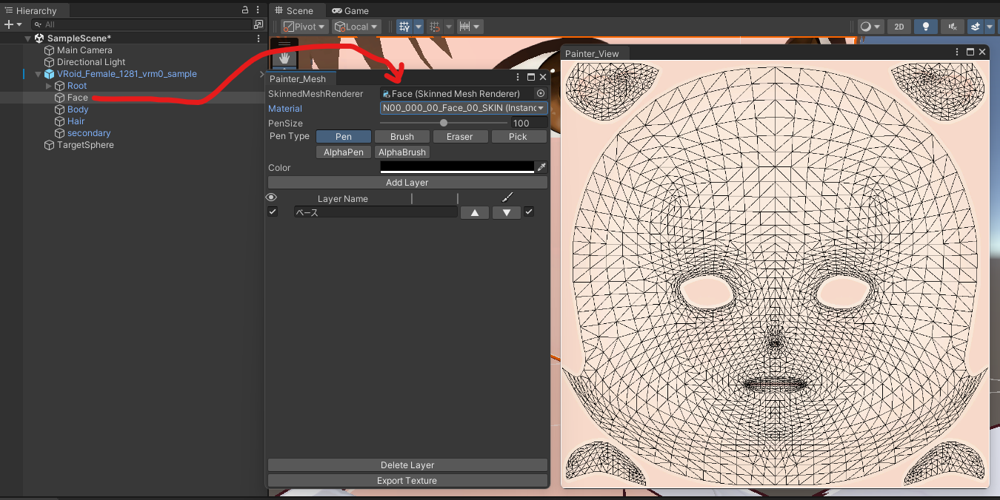
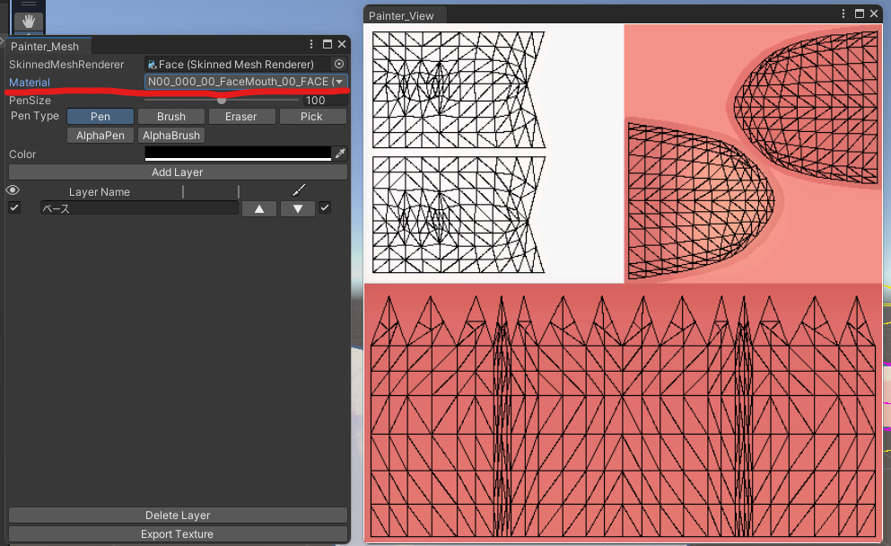
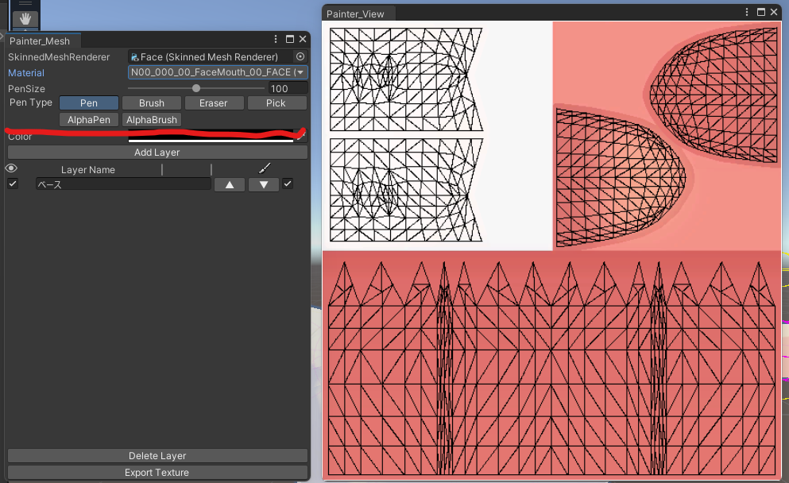

## 始めに

このツールは簡易ペイントツールです。 

導入については[こちら](/Kuni_Tool/common/install/)をご覧ください。 

:::caution
Undo（ctrl+z）は使えないので必ずレイヤーを追加して塗ってください。 
:::

## 使い方

- Hierarchy から編集したいテクスチャが含まれるオブジェクト(SkinnedMeshRenderer)をセットしてください。 

- Material の項目から編集したいテクスチャを選んでください。 

- PenSize の項目からペンの太さを調整できます。 

- PenType の項目からペンの種類を変更できます。 

- Pen

標準的な塗りつぶしペンです。 

- Brush

ブラシペンです。 
ペンの中心から離れるほど透明になります。 

- Eraser

消しゴムです。 
ベタ消しします。 

- Pick

色を抽出します。 
全レイヤーの合成結果の色から取得します。 

- AlphaPen

色設定のアルファ値で元画像のアルファ値から引き算します。 
計算方法の違いなので基本は Pen と同じような塗り方と思ってください。 

- AlphaBrush

AlphaPen のブラシ版です。 

- Color の項目からペンの色を選択できます。 

テクスチャを切り替えるとデフォルトの黒に戻るので注意してください。 

- Add Layer のボタンでレイヤーを追加できます。 

レイヤーリストはツール下部に表示されます。 

左のチェックマークでレイヤーの表示非表示を切り替えます。 

右側の上下ボタンでレイヤーの上下移動ができます。 

レイヤーは下にいくほど画面は上に表示されます。 

一番右のチェックマークは選択中のレイヤーです。 

- Delete Layer ボタンは選択中のレイヤーを削除します。 

- Export Texture ボタンで表示中のレイヤーを合成してテクスチャを生成します。 

生成したテクスチャは元テクスチャの置いてあるフォルダに置かれてあります。 
