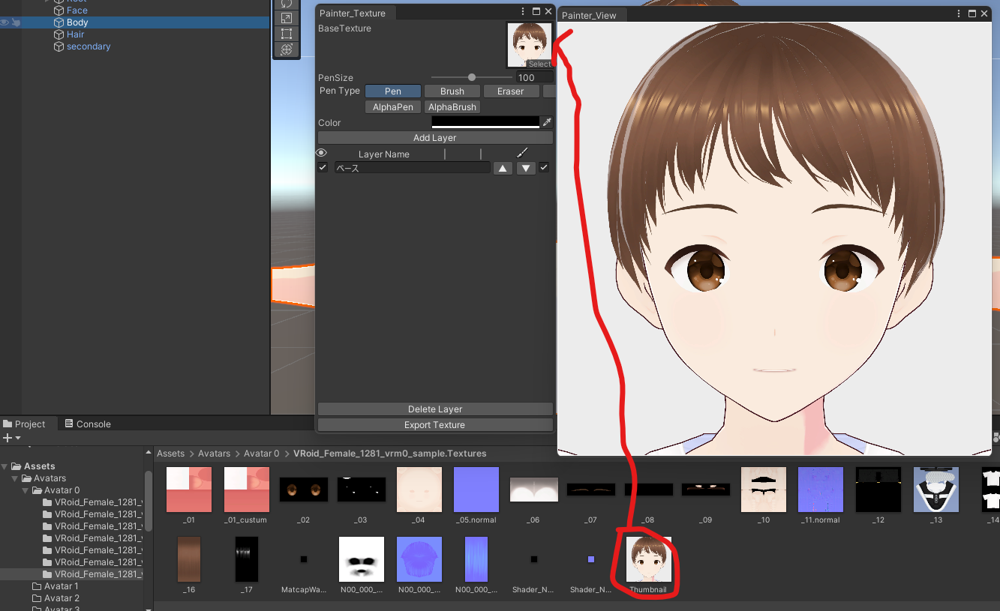

## 始めに

このツールは簡易ペイントツールです。 

導入については[こちら](/Kuni_Tool/common/install/)をご覧ください。 

:::caution
Undo（ctrl+z）は使えないので必ずレイヤーを追加して塗ってください。 
:::

## 使い方

Project ウインドウにあるテクスチャをツールにセットしてください。 

他、使い方は基本的に PainterWithSkinnedMesh と同じなので[PainterWithSkinnedMesh](/Kuni_Tool/tools/PainterWithSkinnedMesh/)を参照してください。 
