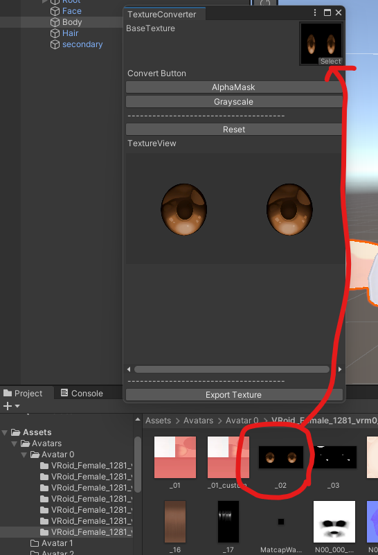

## 始めに

導入については[こちら](/Kuni_Tool/common/install/)をご覧ください。 

## 使い方

Project ウインドウにあるテクスチャをツールにセットしてください。 

- AlphaMask

画像の透明情報からマスク画像を生成します。 

- Grayscale

画像の色情報から白黒画像を生成します。 

- Export Texture

変換した画像を出力します。 
